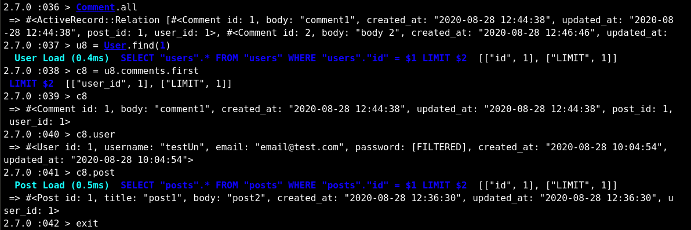

# Micro-Reddit

> A mini example application of rails migrations built with Ruby on Rails.

## Built With

-   Ruby
-   Ruby on Rails
-   VS Code \* Atom
-   Ubuntu & Mac

## Getting Started

To get a local copy up and running follow these simple example steps.

### Prerequisites

1.  Ruby 2.7
2.  Rails 6

### Setup

1.  Clone this repository with
    `git clone https://github.com/defoebrand/micro-reddit.git` using your terminal or command line.
2.  Change to the project directory by entering `cd micro-reddit` in the terminal
3.  Next run `bundle install` to install the necessary dependencies
4.  Run `rails db:migrate` to setup your local database.
5.  Finally run `rails console` to start the application.

## Authors

👤 **Mark Rode**

-   Github: [@m15e](https://github.com/m15e)

👤 **Brandon Defoe**

-   Github: [@defoebrand](https://github.com/defoebrand)
-   LinkedIn: [@defoebrand](https://www.linkedin.com/in/defoebrand/)
-   Gmail: <mailto:defoe.brand@gmail.com>

## Show your support

Give a ⭐️ if you like this project!

## Acknowledgments

-   The Odin Project
-   Microverse

## 📝 License

This project is [MIT](lic.url) licensed.
